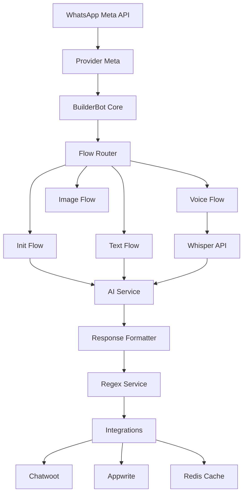

# 🔧 Guía de Desarrollo - EvoBot Meta

## 📋 Tabla de Contenidos

1. [Configuración del Entorno de Desarrollo](#configuración-del-entorno-de-desarrollo)
2. [Arquitectura del Sistema](#arquitectura-del-sistema)
3. [Flujos de Conversación](#flujos-de-conversación)
4. [Integraciones](#integraciones)
5. [Testing](#testing)
6. [Deployment](#deployment)
7. [Troubleshooting](#troubleshooting)

## 🚀 Configuración del Entorno de Desarrollo

### Prerrequisitos

```bash
# Node.js 18+
node --version

# pnpm como package manager
npm install -g pnpm

# Redis server
redis-server --version
```

### Setup Inicial

1. **Clona y configura el proyecto:**
```bash
git clone <repository-url>
cd evobot-meta
pnpm install
```

2. **Configura variables de entorno:**
```bash
cp .env.example .env
# Edita .env con tus configuraciones
```

3. **Inicia Redis (si no está corriendo):**
```bash
redis-server
```

4. **Inicia el bot en modo desarrollo:**
```bash
pnpm dev
```

### Scripts de Desarrollo

```bash
pnpm dev       # Desarrollo con hot reload + linting
pnpm build     # Build para producción
pnpm start     # Ejecuta la versión compilada
pnpm lint      # Solo linting
```

## 🏗️ Arquitectura del Sistema

### Flujo de Datos



### Patrones de Diseño Utilizados

#### 1. Factory Pattern
```typescript
// src/Connections/
// Cada servicio implementa su propia factory
const chatwootService = new ChatwootService();
const appwriteService = new AppwriteService();
```

#### 2. Observer Pattern
```typescript
// BuilderBot flows actúan como observers
const initFlow = addKeyword(EVENTS.WELCOME).addAction(async (ctx, { gotoFlow }) => {
  // Reacciona a eventos de WhatsApp
});
```

#### 3. Strategy Pattern
```typescript
// src/Utils/regex.ts
// Diferentes estrategias de procesamiento según el contenido
class RegexService {
  async processText(text: string, state: any, provider: any) {
    // Estrategia basada en el contenido del mensaje
  }
}
```

#### 4. Singleton Pattern
```typescript
// src/Connections/redis.ts
export class RedisClient {
  private static instance: RedisClient | null = null;
  
  public static getInstance(): RedisClient {
    if (!RedisClient.instance) {
      RedisClient.instance = new RedisClient();
    }
    return RedisClient.instance;
  }
}
```

## 🔄 Flujos de Conversación

### Creando un Nuevo Flow

1. **Crea el archivo del flow:**
```typescript
// src/Flows/custom.flow.ts
import { addKeyword, EVENTS } from "@builderbot/bot";
import { MemoryDB as Database } from "@builderbot/bot";
import { MetaProvider as Provider } from "@builderbot/provider-meta";

const customFlow = addKeyword<Provider, Database>(['palabra_clave'])
  .addAction(async (ctx, { state, gotoFlow, endFlow, provider }) => {
    // Tu lógica aquí
    
    // Actualizar estado
    await state.update({ custom_data: 'valor' });
    
    // Ir a otro flow
    return gotoFlow(otherFlow);
    
    // O terminar
    return endFlow();
  });

export default customFlow;
```

2. **Registra el flow en app.ts:**
```typescript
// src/app.ts
import customFlow from "./Flows/custom.flow";

const adapterFlow = createFlow([
  initFlow,
  textFlow,
  customFlow, // Agregar aquí
  // ...otros flows
]);
```

### Mejores Prácticas para Flows

```typescript
// ✅ Buenas prácticas
const flow = addKeyword(['trigger'])
  .addAction(async (ctx, { state, endFlow, provider }) => {
    // 1. Validar número de teléfono del bot
    if (ctx.to !== botPhoneNumber) {
      return endFlow();
    }
    
    // 2. Actualizar estado con información del usuario
    await state.update({
      name: ctx.name,
      phone: ctx.from,
      message_id: ctx.message_id,
    });
    
    // 3. Manejar errores
    try {
      // Tu lógica
    } catch (error) {
      logger.error(`Error en flow: ${error}`);
      return endFlow();
    }
  });
```

## 🔌 Integraciones

### Agregando una Nueva Integración

1. **Crea el servicio base:**
```typescript
// src/Services/mi-servicio.ts
import { BaseIntegrationService, IntegrationResponse } from "src/interfaces/types";

export class MiServicio extends BaseIntegrationService {
  private apiKey: string;
  private baseUrl: string;

  constructor() {
    super();
    this.apiKey = process.env.MI_SERVICIO_API_KEY || '';
    this.baseUrl = process.env.MI_SERVICIO_BASE_URL || '';
  }

  async processTag(text: string, state: Map<string, any>): Promise<IntegrationResponse> {
    try {
      // Tu lógica de integración
      return {
        success: true,
        text: "Respuesta del servicio"
      };
    } catch (error) {
      this.logger.error(`Error en Mi Servicio: ${error}`);
      return {
        success: false,
        text: "Error al procesar solicitud"
      };
    }
  }

  isEnabled(): boolean {
    return !!(this.apiKey && this.baseUrl);
  }
}
```

2. **Registra en el regex service:**
```typescript
// src/Utils/regex.ts
import { MiServicio } from "src/Services/mi-servicio";

const miServicio = new MiServicio();

// Agregar en processText method
if (text.includes('#mi_tag') && miServicio.isEnabled()) {
  const result = await miServicio.processTag(text, state);
  if (result.success) {
    responseText = result.text;
  }
}
```

### Estructura de una Integración Completa

```typescript
// Archivo de conexión
// src/Connections/mi-api.ts
class MiAPIClient {
  private apiKey: string;
  private baseUrl: string;
  
  constructor() {
    this.apiKey = process.env.MI_API_KEY || '';
    this.baseUrl = process.env.MI_API_URL || '';
  }
  
  async makeRequest(endpoint: string, data: any) {
    // Implementación de la llamada HTTP
  }
}

// Servicio de negocio
// src/Services/mi-servicio.ts
class MiServicio {
  private client: MiAPIClient;
  
  constructor() {
    this.client = new MiAPIClient();
  }
  
  async processBusinessLogic(data: any) {
    // Lógica específica del negocio
  }
}

// Controller para webhooks
// src/Controllers/controllers.ts
export async function miServicioWebhook(bot, req, res) {
  try {
    // Procesar webhook
    const { data } = req.body;
    // ... lógica
    res.writeHead(200, { "Content-Type": "application/json" });
    return res.end(JSON.stringify({ status: "success" }));
  } catch (error) {
    // Error handling
  }
}
```

## 🧪 Testing

### Configuración de Tests

```bash
# Instalar dependencias de testing
pnpm add -D jest @types/jest ts-jest

# Crear jest.config.js
module.exports = {
  preset: 'ts-jest',
  testEnvironment: 'node',
  roots: ['<rootDir>/src', '<rootDir>/tests'],
  testMatch: ['**/__tests__/**/*.ts', '**/?(*.)+(spec|test).ts'],
  transform: {
    '^.+\\.ts$': 'ts-jest',
  },
};
```

### Ejemplos de Tests

```typescript
// tests/services/regex.test.ts
import { RegexService } from '../src/Utils/regex';

describe('RegexService', () => {
  let regexService: RegexService;
  
  beforeEach(() => {
    regexService = new RegexService(mockProvider);
  });
  
  test('should process calendar tag correctly', async () => {
    const text = 'Texto con #calendario';
    const state = new Map();
    
    const result = await regexService.processText(text, state, mockProvider);
    
    expect(result).toContain('calendario procesado');
  });
});
```

### Testing de Integraciones

```typescript
// tests/integrations/chatwoot.test.ts
import ChatwootService from '../src/Connections/chatwoot.class';

describe('ChatwootService', () => {
  test('should create contact successfully', async () => {
    const chatwoot = new ChatwootService();
    
    const result = await chatwoot.createContact('5491234567890', 'Test User');
    
    expect(result).toHaveProperty('id');
    expect(result.name).toBe('Test User');
  });
});
```

## 🚀 Deployment

### Deployment con Docker

```dockerfile
# Dockerfile optimizado para producción
FROM node:18-alpine AS builder

WORKDIR /app
COPY package*.json pnpm-lock.yaml ./
RUN npm install -g pnpm && pnpm install --frozen-lockfile

COPY . .
RUN pnpm build

FROM node:18-alpine AS runner
WORKDIR /app

RUN npm install -g pnpm
COPY package*.json pnpm-lock.yaml ./
RUN pnpm install --prod --frozen-lockfile

COPY --from=builder /app/dist ./dist
COPY --from=builder /app/patches ./patches

EXPOSE 3004
CMD ["pnpm", "start"]
```

### Variables de Entorno para Producción

```bash
# .env.production
NODE_ENV=production
PORT=3004

# Logging
LOG_LEVEL=info
LOG_TO_FILE=true

# Optimizaciones
NODE_OPTIONS="--max-old-space-size=4096"
UV_THREADPOOL_SIZE=128
```

### Docker Compose para Desarrollo

```yaml
# docker-compose.dev.yml
version: '3.8'
services:
  evobot:
    build: .
    ports:
      - "3004:3004"
    environment:
      - NODE_ENV=development
    volumes:
      - ./src:/app/src
      - ./logs:/app/logs
    depends_on:
      - redis
      
  redis:
    image: redis:7-alpine
    ports:
      - "6379:6379"
    volumes:
      - redis_data:/data
      
volumes:
  redis_data:
```

## 🛠️ Troubleshooting

### Problemas Comunes

#### 1. Error de Conexión con Meta API
```bash
# Verificar configuración
echo $BOT_JWT_TOKEN
echo $BOT_NUMBER_ID

# Testear webhook
curl -X POST https://tu-servidor.com/webhook \
  -H "Content-Type: application/json" \
  -d '{"test": true}'
```

#### 2. Redis Connection Error
```bash
# Verificar Redis
redis-cli ping

# Verificar configuración
echo $REDIS_URL
```

#### 3. AI API Timeouts
```typescript
// Configurar timeouts más largos
const openai = new OpenAI({
  apiKey: process.env.OPENAI_API_KEY,
  timeout: 60000, // 60 segundos
});
```

### Debugging

#### Logs Detallados
```typescript
// Habilitar logs detallados en desarrollo
const logger = new Logger();
logger.setLevel('debug'); // en desarrollo

// Logs específicos por servicio
logger.log('🤖 AI: Request sent to OpenAI');
logger.log('📱 WhatsApp: Message sent successfully');
logger.log('💾 Database: Record created');
```

#### Monitoreo en Tiempo Real
```bash
# Seguir logs en tiempo real
tail -f logs/bot.log

# Filtrar por tipo de log
tail -f logs/bot.log | grep ERROR

# Monitorear memoria y CPU
top -p $(pgrep -f "node.*app.js")
```

### Health Checks

```typescript
// src/Controllers/controllers.ts
export async function healthCheck(req, res) {
  const health = {
    status: 'ok',
    timestamp: new Date().toISOString(),
    services: {
      redis: await checkRedis(),
      appwrite: await checkAppwrite(),
      openai: await checkOpenAI(),
    }
  };
  
  res.writeHead(200, { "Content-Type": "application/json" });
  return res.end(JSON.stringify(health));
}
```

### Performance Optimization

#### 1. Caching Strategies
```typescript
// Cache respuestas de IA frecuentes
const cacheKey = `ai_response:${phoneNumber}:${messageHash}`;
const cachedResponse = await redisClient.get(cacheKey);

if (cachedResponse) {
  return JSON.parse(cachedResponse);
}

// Cache por 1 hora
await redisClient.setex(cacheKey, 3600, JSON.stringify(response));
```

#### 2. Queue Management
```typescript
// Configurar cola con prioridades
const queueConfig: QueueConfig = {
  gapSeconds: parseInt(process.env.BOT_COUNTDOWN_TIME) || 3000,
  concurrent: 3, // Máximo 3 mensajes simultáneos
  interval: 500,  // 500ms entre trabajos
};
```

#### 3. Memory Management
```typescript
// Limpiar archivos temporales
const cleanupTemp = () => {
  tmp.setGracefulCleanup();
};

process.on('exit', cleanupTemp);
process.on('SIGINT', cleanupTemp);
```

## 📚 Recursos Adicionales

- [BuilderBot Documentation](https://builderbot.vercel.app/)
- [WhatsApp Business API Docs](https://developers.facebook.com/docs/whatsapp)
- [OpenAI API Reference](https://platform.openai.com/docs/api-reference)
- [Redis Documentation](https://redis.io/documentation)

---

**💡 Tip:** Mantén siempre actualizada esta documentación cuando agregues nuevas funcionalidades.
